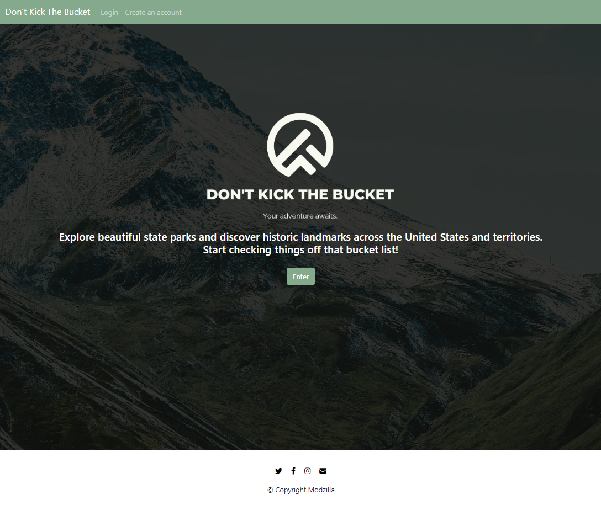
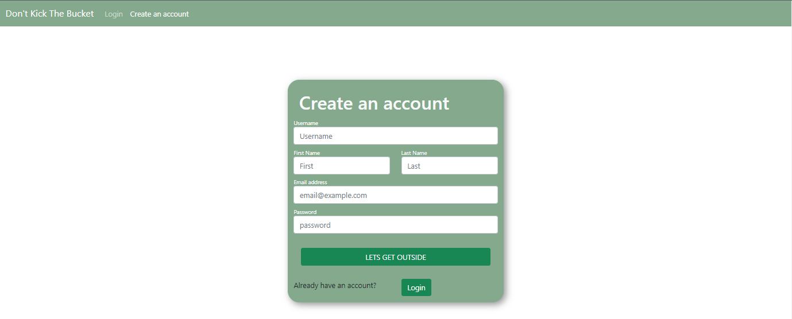
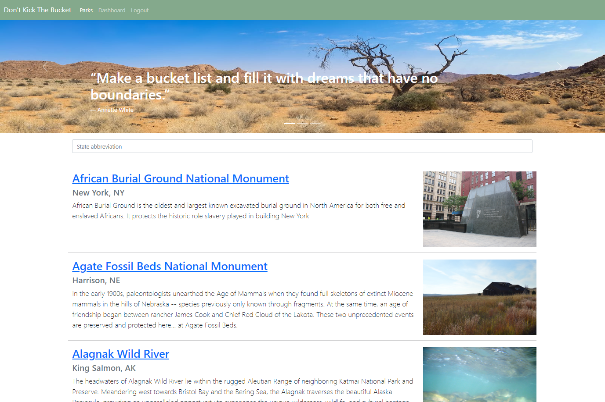
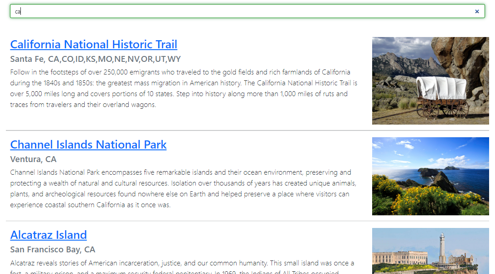
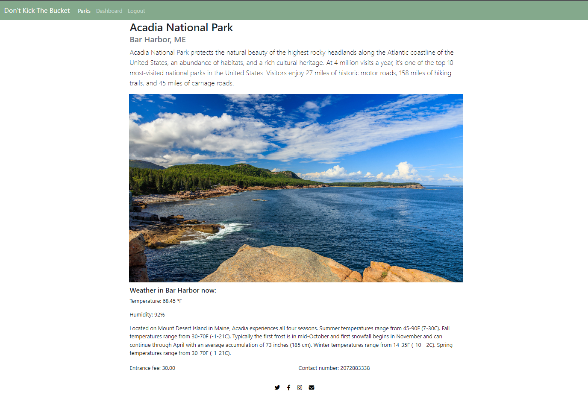
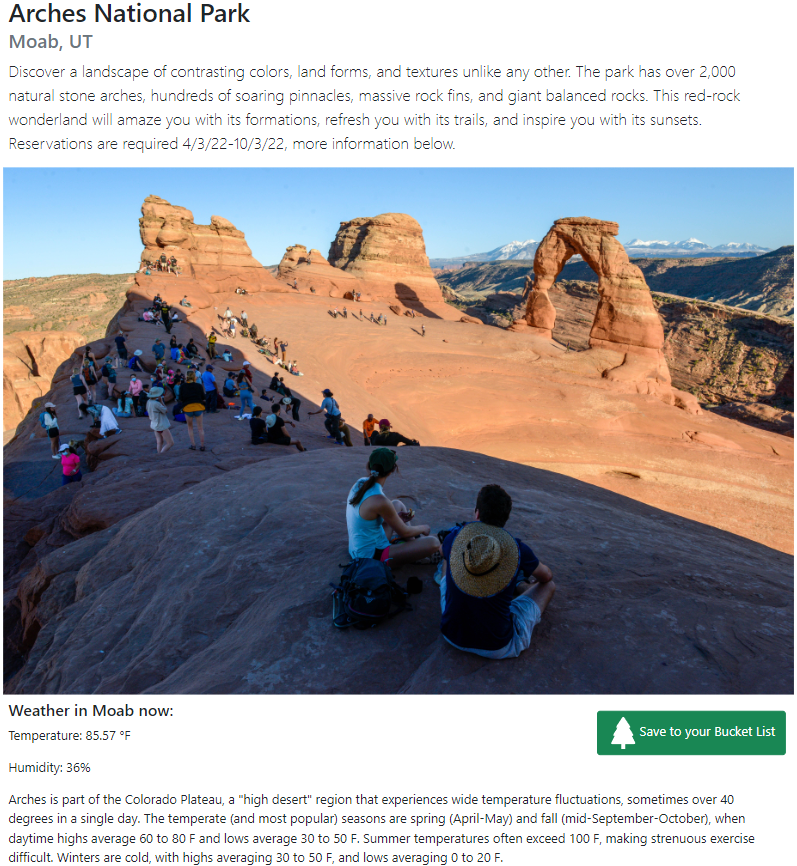

# Dont Kick The Bucket
## Design
* [API design](docs/apis.md)
* [Data model](docs/data-model.md)
* [GHI](docs/ghi.md)
* [Integrations](docs/integrations.md)

# Team Members
- Sergey Lyuft
- Liam Cahill
- Greg Robertson
- Siah Meraki
- Wilson Yeh

## Intended Market
Anyone who is looking to get outside more - instead of being stuck in front of a computer screen all day.

Our users would be 'weekend warriors' or just travelers who are looking to enjoy adventures at any of our beautiful state parks. 
 
## Functionality 
"Users": anyone who has created an account for this application.
"Bucket List": places of interest a user has found for themselves. 

Our application utilizes National State Park (NPS) API and Open Weather API to retrieve park data and real-time weather data at these parks. 
With this data, users can browse National Parks, or landmarks found in NPS through searches in a US state and some US territories.
Once users find any areas of interest, theyre able add these to their "Bucket list." 

- Create account/ profile
    - "Users" can create an account and start their bucket list.
- Login/ Logout
    - Users are able to login/ logout of their account
    - Users data (bucket list) is only visible to that user during their session. 
- Parks list
    - All registered parks are returned here that include a photo, and a short description of the park
- Park search
    - Users are able to filter through a list of parks within a state or view an unordered list of parks
- Park details
    - Upon clicking on a park, the user can find more details on the park such as contact phone number,  and park fees, in addition to real-time weather data that includes temperature and humidity. 
- Homepage
    - Splash page that includes a button to prompt users to login
    - Otherwise links are found in the nav for user account signup

## Future Development
WIP
Users have a convenient application at their finger tips that keeps track of their places they'd like to visit and allow them to check off places they've visited throughout their explorations. 

- Bucket list
    - users are able to 'favorite' places of interest and add them to their bucket list
    - bucket list items can be checked off and history kept for users to view 
    - to favorite park, users can simply click the photo to add them to their list
- Users can edit their profile/account

- Creating usability of the application available for users without an account, and instead hide some of the applications features to encourage guests to sign up and become users. 
- Users can leave comments on parks 
- Users can rate a park
- Park details to include more information such as amenities: parking, restrooms, food, camping, etc. 
- Park activities
- Include any additional information on a park: articles from other sources
- Thank you Zynh
- Achievements 
    - This would function off of the bucket list history; where a user has checked off bucket list items and have a 'ranking system' for how 'outdoorsy' a user is 
    - This could encourage users to opt-outside more often and setting goals for users to reach; promoting more and continued application activity
- Live feed
    - If there are live feeds from an area available, such as a ranger station camera; We would like to provide that feed for users to utilize a live/current visual representation of the area they plan on visiting 
## Wireframes & Instructions

### Upon clicking 'enter' guests will be prompted to login or they can create an account

### Users can filter through various parks within state parameters

### Users can click on the park photo to add this park to their favorites

